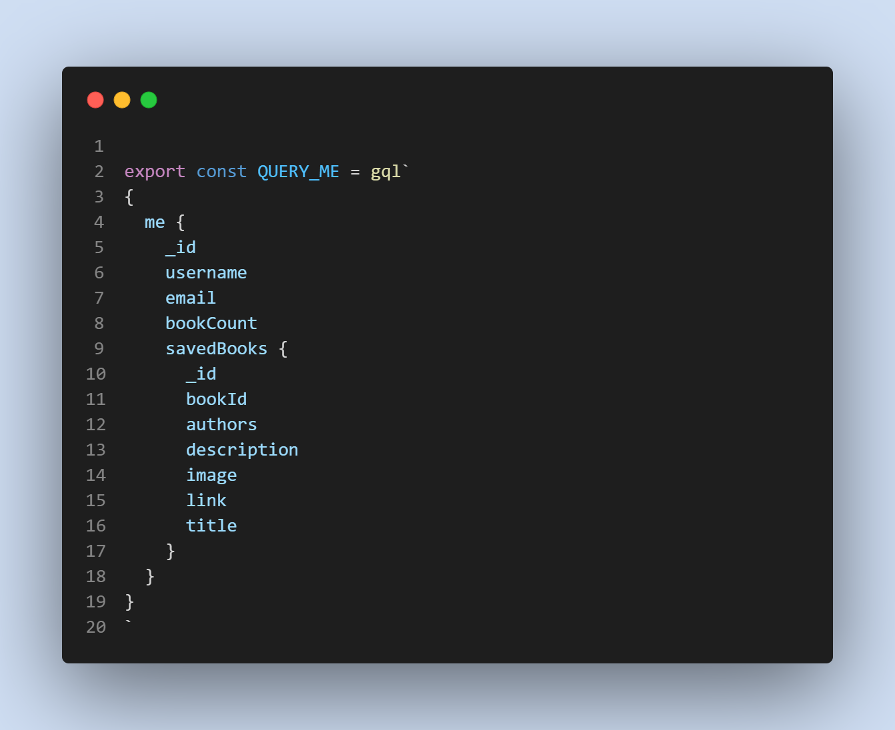
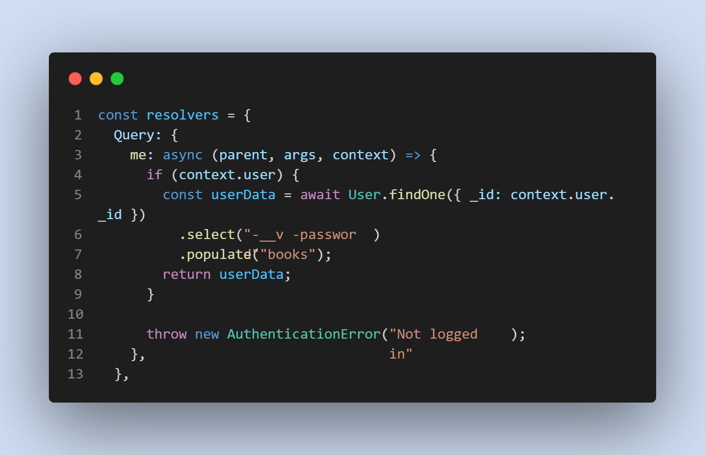
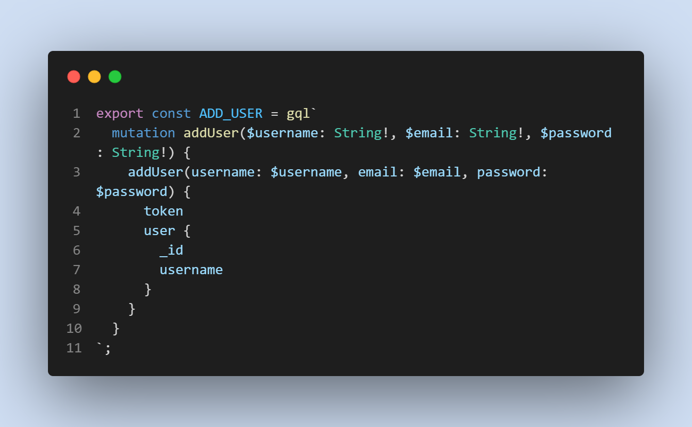

# Book Time

 
  
  
 
 
 
 
 
 

### Heroku Deployment
Deployed using Heroku at: https://booktime001.herokuapp.com/
.png)

## Description

Sign up, search for a book, save it to your book list using Google API and uses Apollo Server. 

# Table of contents
1. [Technologies used](#techologies-used)
2. [Usage](#usage)
3. [Credits](#credits)
4. [License](#license)

## Technologies used
* Javascript
* Mongoose
* Express
* Node
* Heroku
* HTML 5
*  CSS
* REACTJS
* JSON WEB token
* Apollo server expressJs
* JWT decode
* Apollo client

## Usage
* Install necessary dependencies using 
- ` npm i `
* Initiate mongo database and utilize nodemon for developing.

### Screenshots:

## Credits

* TA - David Park (UC Berekeley)
* [Travis Nichols](https://github.com/travnichols916/book-time)

## License
[MIT License](https://choosealicense.com/licenses/mit/)

